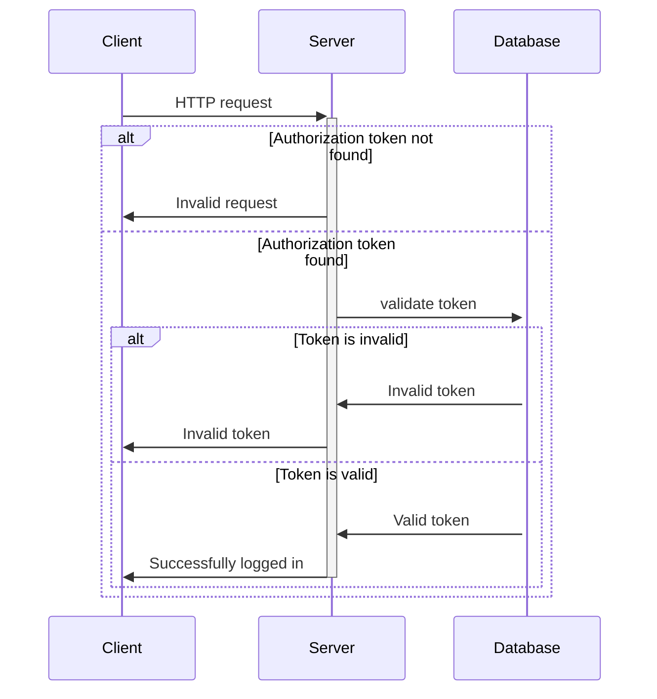

# Authentication mechanism

This API is using Bearer authentication as an HTTP authentication scheme. The client needs to send an `Authorization: Bearer <token>` header with a valid token in order to establish a successful connection with the API.

## How it works?

